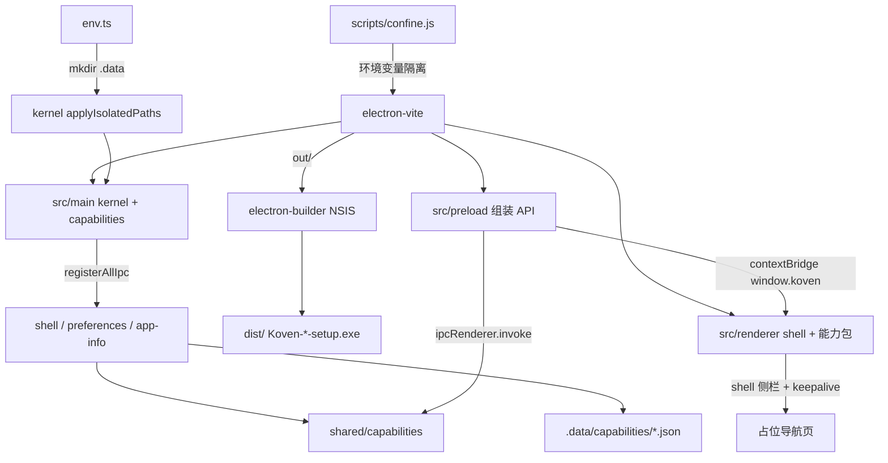

# Koven 知识图谱分片：01 概览（项目定位 / 技术栈 / 目录结构 / 架构）

> 路由：`knowledge/01-overview.md`（路由表 knowledge-graph.md 的 01 号分片）
> 覆盖内容：项目定位 / 技术栈 / 目录结构 / 架构总览
> 何时读：新会话建立上下文；涉及依赖选型、版本核对、整体架构理解

## 1. 项目定位

| 项 | 值 |
|---|---|
| 名称 | Koven |
| 形态 | Windows-only Electron 桌面应用 |
| 定位 | 可运行的桌面壳；业务从零开始，先固定安全模型与落盘隔离 |
| 当前阶段 | 壳 UI（侧栏 / topbar / 托盘）+ A/B JSON 持久化已跑通；无真实业务数据 |
| 关键约定 | 仅 Windows（AGENTS.md 铁律 11）；渲染进程无 Node（铁律 12）；文件不出项目目录（铁律 1）；增量走能力包（`10-architecture.md`） |

## 2. 技术栈

官方选型（以此为准，不要另起一套）：

| 层 | 选型 |
|---|---|
| UI 库 | **Radix UI** primitives |
| 主代码 | **Electron + React + TypeScript** |
| 包管理器 | **npm**（项目内 `node_modules` + `.npm-cache`） |
| CSS | **Tailwind CSS 4**（`@tailwindcss/vite`） |
| 开发打包 | **electron-vite**（Vite 7，出 `out/`） |
| 安装包 | **electron-builder**（仅 Windows x64 NSIS，出 `dist/`） |
| 状态 | **Zustand 5** |

版本与周边：

- **Electron 44.2.0**（Chromium 152 / Node 24）
- **React 19** + **TypeScript 5** strict（`tsconfig.node.json` / `tsconfig.web.json`）
- Radix：`@radix-ui/react-slot` / `dialog` / `dropdown-menu` / `separator` + **cva** + **clsx** + **tailwind-merge**（`cn()`）
- **lucide-react**（图标，禁止为常规图标手写 SVG）
- `@electron-toolkit/utils`、`@electron-toolkit/tsconfig`；入口隔离 `scripts/confine.js`

## 3. 目录结构

```
D:\Desktop\Koven
├── AGENTS.md
├── knowledge-graph.md
├── knowledge/                 # 图谱分片 01-10
├── scripts/
│   ├── confine.js
│   ├── build-win.mjs
│   ├── check-file-budget.mjs
│   ├── check-capability-sync.mjs
│   ├── new-capability.mjs
│   └── sync.mjs
├── vitest.config.ts
├── eslint.config.mjs
├── src/
│   ├── main/
│   │   ├── env.ts             # 先于 electron 的环境与路径隔离
│   │   ├── index.ts           # 只 import env + startApp
│   │   ├── kernel/            # 窗口、路径、IPC 总注册、存储端口
│   │   └── capabilities/      # 按包：register + use-case
│   ├── preload/
│   │   ├── index.ts           # 组装 window.koven
│   │   ├── index.d.ts
│   │   ├── kernel/
│   │   └── capabilities/
│   ├── shared/
│   │   ├── app-api.ts         # AppAPI 交集组装
│   │   ├── kernel/result.ts
│   │   └── capabilities/      # 每包通道 + DTO + API 类型
│   └── renderer/src/
│       ├── main.tsx
│       ├── app/App.tsx        # 只挂壳
│       ├── shell/             # 标题栏、侧栏、keepalive、会话 hydrate
│       ├── routes.ts
│       ├── capabilities/      # preferences / app-info（关于）
│       ├── components/ui/
│       ├── lib/cn.ts
│       └── assets/            # main.css、koven.png
├── build/koven.ico
├── out/  dist/  .data/  .npm-cache/  .electron-cache/  .electron-builder-cache/
```

增量目录细则见 `10-architecture.md`。

## 4. 架构总览



- 主进程负责窗口、路径、系统能力与 JSON 真源；业务 handle 在能力包里注册。
- preload 是唯一桥梁，只暴露白名单方法。
- 渲染进程是普通 React SPA；`App.tsx` hydrate 后挂壳，页面经 `routes.ts` + keepalive。
- Windows 安装包由 electron-builder 从 `out/` 打 NSIS，产物在 `dist/`。
